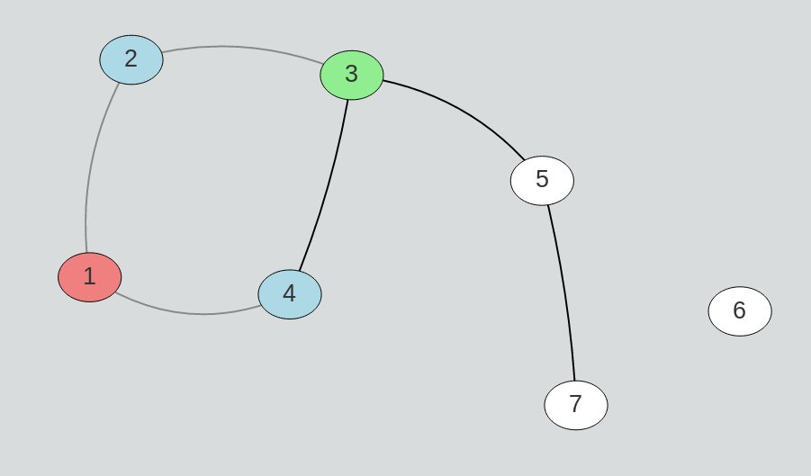
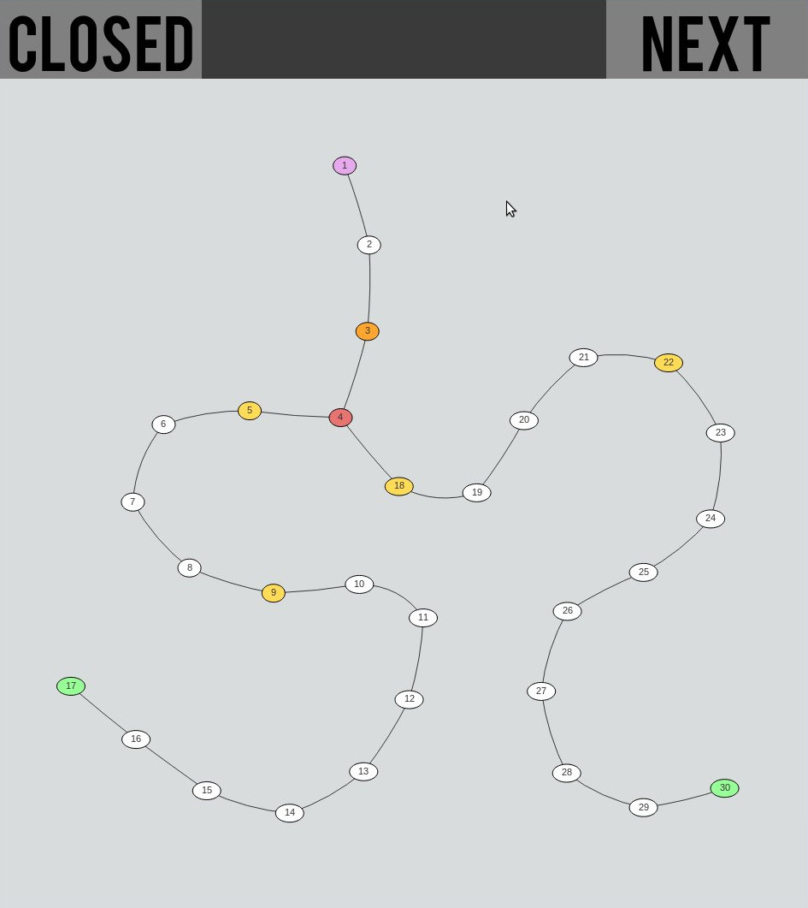

# Glotter [](https://travis-ci.org/matcegla/glotter)
`glotter` is a tool meant for visualizing graphs and algorithms operating on them for the purposes of debugging. Traditional debuggers such as `gdb` are usually not of much use when it comes to graphs. All they can do is display raw edge lists, which are not clear and intuitive. It gets only worse when we introduce more complicated algorithms such as network flow algorithms. `glotter` changes that by adding a GUI which displays the graph visually. You can also mark various things on the graph for your attention.

Traditional debuggers require only to pass `-g` option to the compiler. This is very convenient, but not possible here. Since algorithms we're talking about are complicated and the result is supposed to look nice, `glotter` needs more information about code than basic debuggers want. However, the API is designed so that work and LoC required are as small as possible, allowing for quick debugging. To show how quickly can you add glotter support to a ready program, see commit [e93c7e4](https://github.com/matcegla/glotter/commit/e93c7d4dd7906396fb8dc6300d193f7809072bbb).





## Usage

### Basic example

#### Installation

Download repository, build with cmake & make. Example:
```bash
git clone https://github.com/matcegla/glotter
mkdir glotter/build
cd glotter/build
cmake ..
make
sudo make install
```

#### Writing code

Full example programs with glotter are available in [test/bfs/main.cpp](test/bfs/main.cpp) and [test/lca/main.cpp](test/lca/main.cpp). To see an example of how to add glotter to a ready app, study shown earlier commit [e93c7e4](https://github.com/matcegla/glotter/commit/e93c7d4dd7906396fb8dc6300d193f7809072bbb)(colors like "#F08080" can also be written as their [HTML names](https://www.w3schools.com/tags/ref_colornames.asp), ex. "lightcoral"). Below is an explanation what you need to add and what it does.

```cpp
// Include the header
#include <glotter.hpp>

// Create an object
Glotter glotter;

	// Tell glotter how many vertices the graph will have
	glotter.resize(vertexCount);

	// When adding edges, also tell glotter about them
	glotter.addEdge2(firstVertex, secondVertex);

	// Then, you can change color of edges/vertices as you like
	glotter.setVertexColor(verterxNumber, "lightblue");
	glotter.setEdge2Color(firstVertex, secondVertex, "grey");

	// Glotter will pause the execution after any change automatically
```

#### Compiling

Compile your program normally, but with following flags:
- `-std=c++11` I like C++11.
- `-lglotter` This is us!
- `-luWS` A web server called [uWebSockets](https://github.com/uNetworking/uWebSockets). I am not aware of an Ubuntu package.
- `-lz` Web server needs this for compression stuff. Available in Ubuntu package `zlib1g-dev`.
- `-lssl` Web server needs this for encryption stuff. Available in Ubuntu package `libssl-dev`.
- `-pthread` Web server needs this for threading. Doesn't require installation.

Example command to build the BFS test would be:
```bash
g++ test/bfs/main.cpp -std=c++11 -lglotter -luWS -lz -lssl -pthread
```

#### Running

First, run your compiled app just as you would normally run it. If you are following the BFS test, example input is provided in [test/bfs/input.txt](test/bfs/input.txt) file; if LCA test, then use [test/lca/input1.txt](test/lca/input1.txt) or [test/lca/input2.txt](test/lca/input2.txt). Run your favourite browser and load `localhost:57077`.

#### Using

In right top corner, you will see a "Next" button which is used just like `next` in `gdb`. `glotter` automatically pauses program execution after every visual change. In order to resume in, click the button.

Under the control bar, your graph should be displayed. You can drag nodes around, zoom with mouse scroll, and move the view via dragging the background.

In left top corner, you can see the status bar. It will tell you if everything is working correctly(it should be green with a "Ready" text).

## ~~F~~AQ

**Can this be used simultaneously with a normal debugger?**
Yes, just run it in `gdb`. This is a graph visualization tool, not a complete debugger.

**Can it be used without Internet connection?**
Yes. Browser is required, but all resources are available locally.
